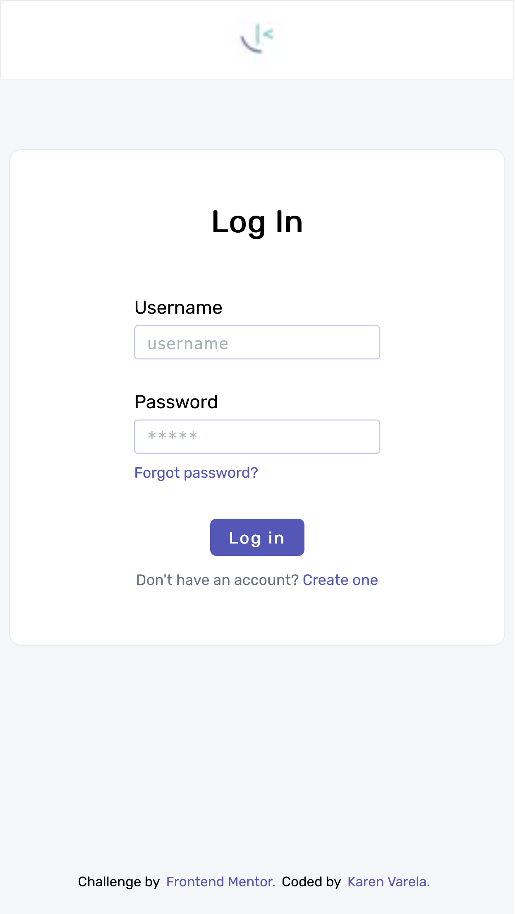
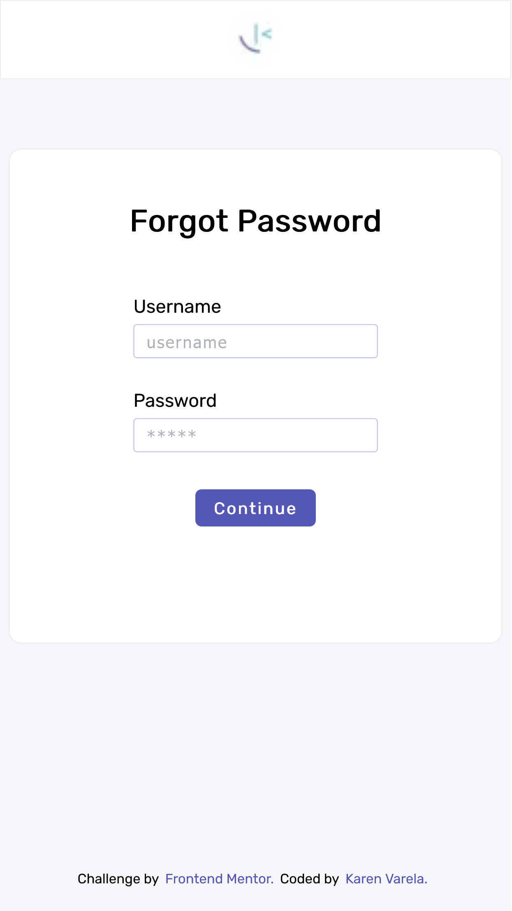
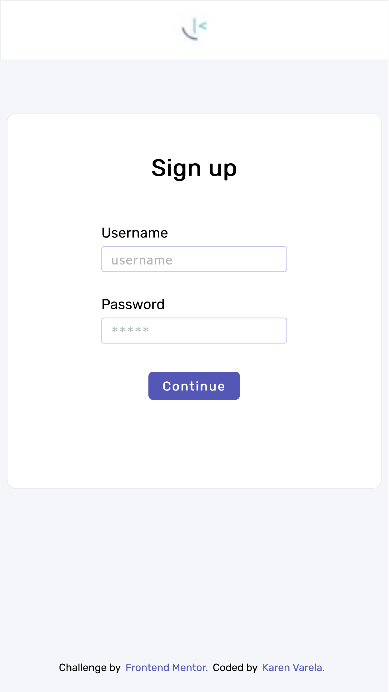
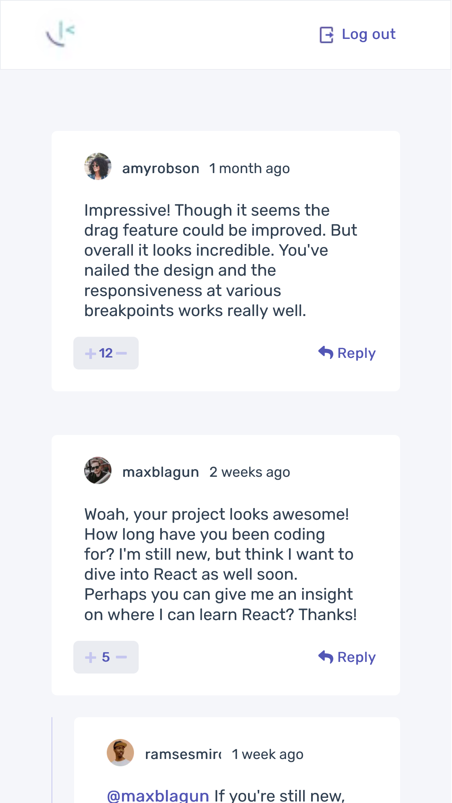
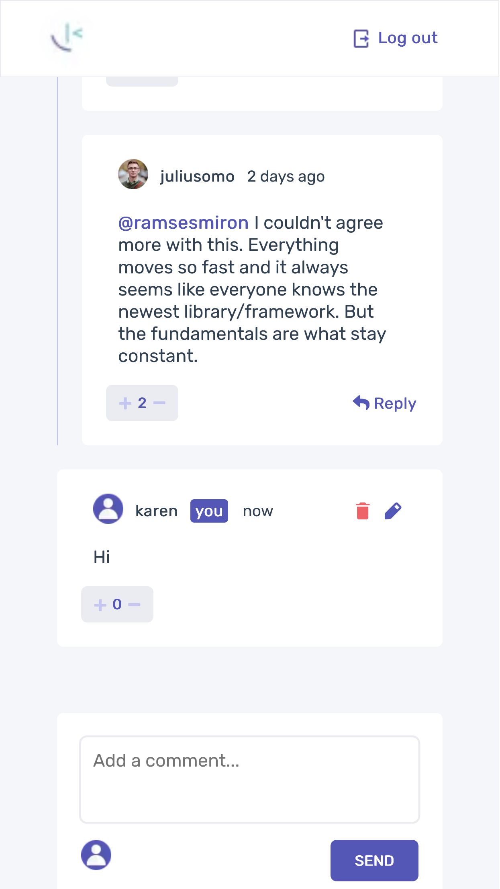
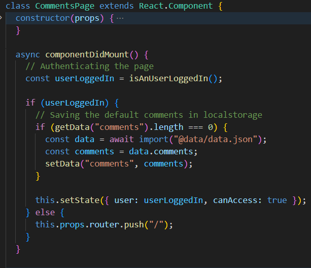
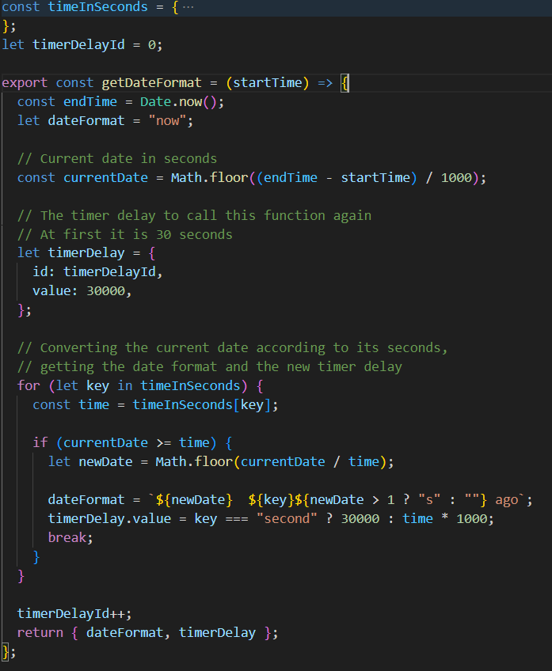
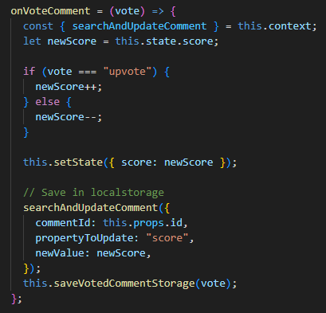
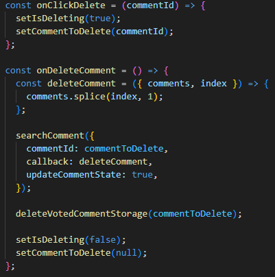

# Frontend Mentor - Interactive comments section solution

This is a solution to the [Interactive comments section challenge on Frontend Mentor](https://www.frontendmentor.io/challenges/interactive-comments-section-iG1RugEG9). Frontend Mentor challenges help you improve your coding skills by building realistic projects.

## Challenge Overview

The goal of this project is to create an interactive comments section that allows users to perform various actions, including viewing the optimal layout on different screen sizes, experiencing hover states for interactive elements, creating, reading, updating, and deleting comments and replies, and upvoting/downvoting comments. Two bonus tasks involve using localStorage for front-end state persistence and dynamically tracking the time since a comment or reply was posted.

All the challenges were successfully completed, and to further enhance my skills, I chose to implement the solution using Next.js.

### Screenshot

_Sign in page_

_Forgot password page_

_Sign up page_

_Comments page_

### Built with

- [React](https://reactjs.org/)
- [Next.js](https://nextjs.org/)

## How it works?

The authentication process redirects users from sign-in, sign-up, and forgot password pages to the comments page upon successful form validation.

### Comments Page Flow

1. During rendering, the app checks for the logged-in user in localStorage.
2. If the user is authenticated, the app renders; otherwise, the user is redirected to the sign-in page.

3. The comments page includes forms for adding, editing, and deleting comments.
4. The AddComment component handles posting comments or replies.
5. The EditComment component provides a form for editing comments.
6. Comment timestamps are dynamically formatted using the getDateFormat utility.

7. Comment scores are updated upon voting, and the voted comment is added to the user's voted comments list.

8. Clicking delete sets up the onClickDelete function, updating the state with the comment ID and displaying the delete modal. Accepting the deletion prompt results in the comment being removed from the comments list.

### State Persistence

All comment-related changes are stored in localStorage to maintain state across browser sessions.

Feel free to explore the code and provide feedback or suggestions. Happy coding!
