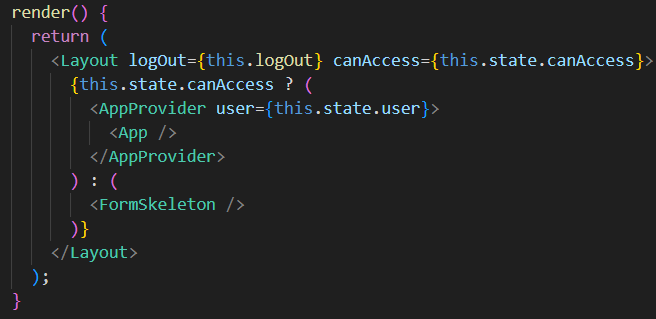
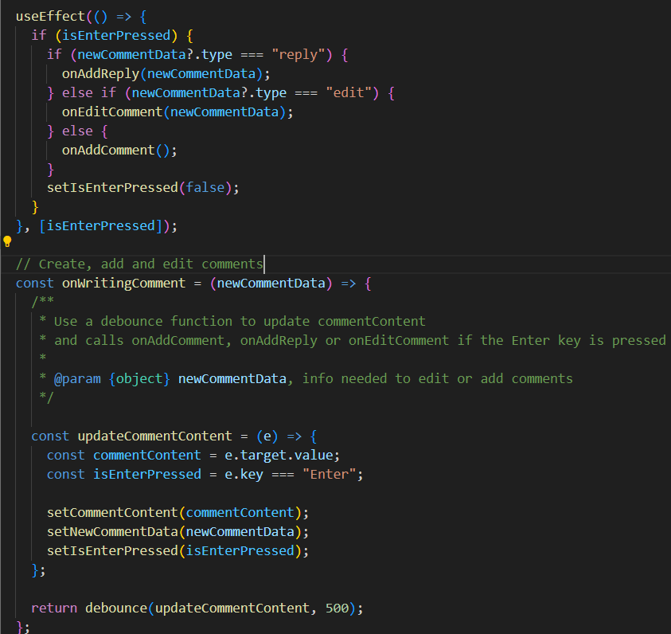
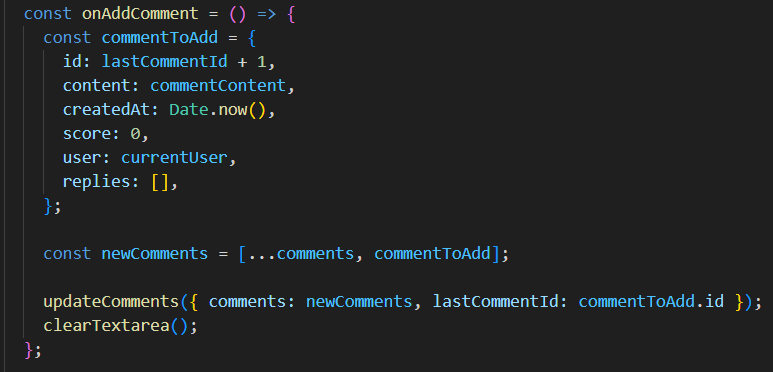
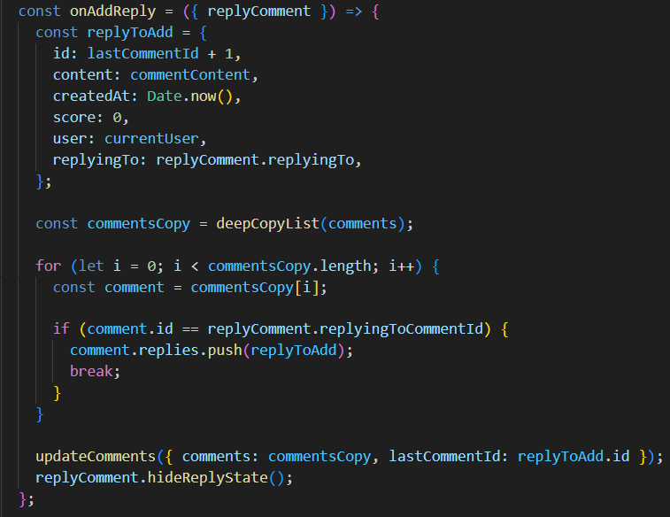
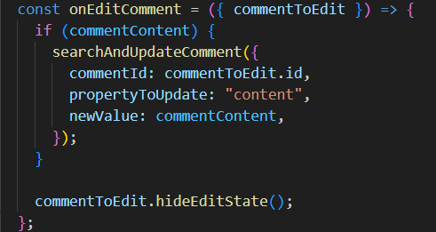
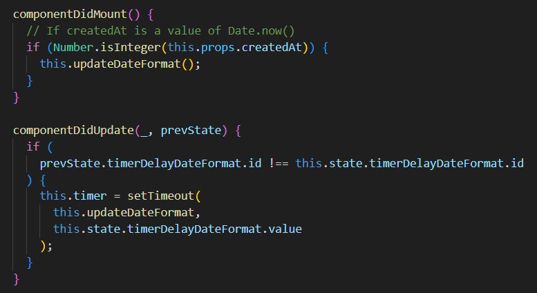

# Frontend Mentor - Interactive comments section solution

This is a solution to the [Interactive comments section challenge on Frontend Mentor](https://www.frontendmentor.io/challenges/interactive-comments-section-iG1RugEG9). Frontend Mentor challenges help you improve your coding skills by building realistic projects.

### The challenge

Users should be able to:

- View the optimal layout for the app depending on their device's screen size
- See hover states for all interactive elements on the page
- Create, Read, Update, and Delete comments and replies
- Upvote and downvote comments
- **Bonus**: If you're building a purely front-end project, use `localStorage` to save the current state in the browser that persists when the browser is refreshed.
- **Bonus**: Instead of using the `createdAt` strings from the `data.json` file, try using timestamps and dynamically track the time since the comment or reply was posted.

All the challenges were completed, and since for this project i wanted to practice NextJS i added some pages to have dynamic users

### Screenshot

_Sign in page_

_Forgot password page_

_Sign up page_

_Comments page_

### Built with

- [React](https://reactjs.org/)
- [Next.js](https://nextjs.org/)

### How works?

The sign in, sign up and forgot password pages will be redirected to comments page after the validation of their respective form

On the comments page i wanted to do something similar to authenticate, searching in the saved users on localstorage the logged in user, meanwhile the form skeleton is rendered. In case the user can access, the app is rendered and if they can't, they will be redirected to sign in page

_src/pages/comments_

All functionality that requires typing in a textarea, either for create or edit comments are listened it by the onWritingComment function. This function use a debounce function to update the commentContent state only when the user stops typing, receives a newCommentData param that is required to add or edit a comment. If the enter key is pressed or the user clicks the send/reply/update button, their respective function will be called

_src/context_

The comments created by the user have in their createdAt property a value of Date.now, and these type of comments update their date format from getDateFormat

_src/components/Comment_

_src/utils/getDateFormat.js_

When voting on a comment, the comment score will be updated and this comment will be added to the user's voted comments list

_src/context_

When the user clicks to the delete button, the onClickDelete function will be called, it has the comment id that will be deleted as a parameter, updates the state of commentToDelete with this id, and the state of isDeleting to true so that the deleteComment modal is displayed. If the user accepts delete the comment, the function will loop through the list until it finds the comment and deletes it.

_src/context_

All these changes in comments list will be saved on localstorage
